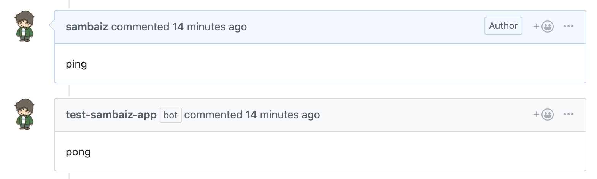

# sam-github-app-hooks-example



1. Create GitHub App
2. Download secret key and upload to secretsmanager

```
$ aws secretsmanager create-secret --name GitHubCdkAppSecretId --secret-string $(cat private-key.pem)
```

3. Edit template.yaml
4. Package and deploy

```
$ make build
$ sam package --output-template-file packaged.yaml --s3-bucket <deploy bucket>
$ aws cloudformation deploy --template-file ./packaged.yaml --stack-name sam-github-app-hooks-example --capabilities CAPABILITY_IAM
```

5. Modify Webhook URL at App Settings